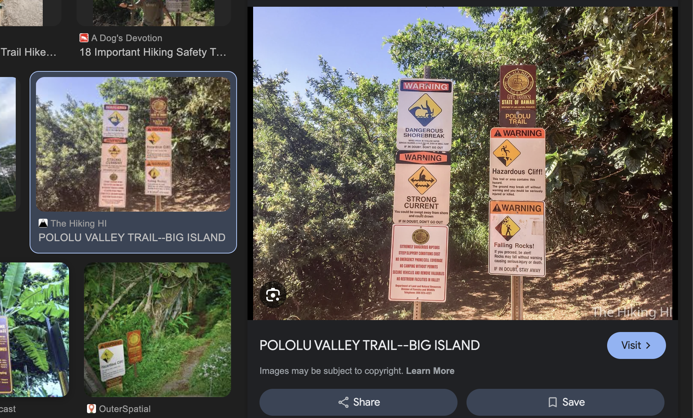
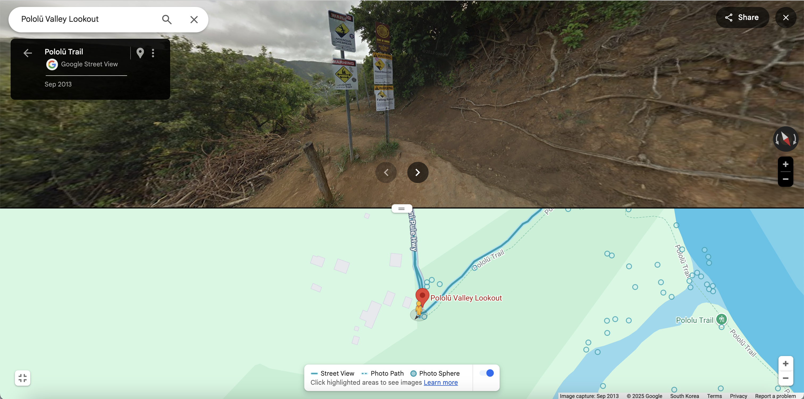
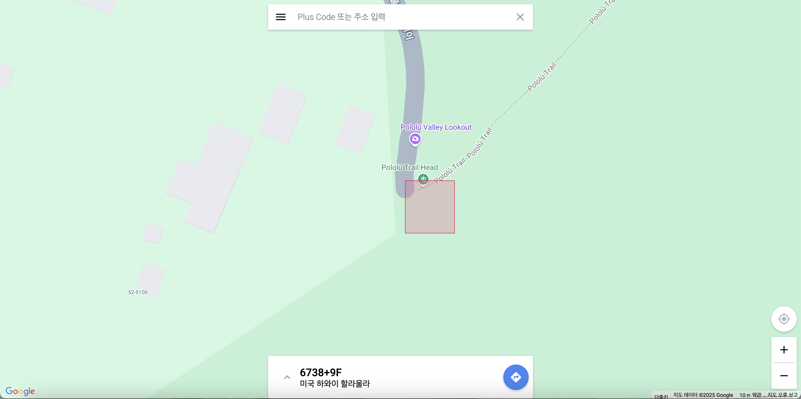

# Main Concept

- Geo Guessing

## Explanation

According to the problem statement, we need to locate a trailhead in Hawaii that has four distinct warning signs:  
**Hazardous cliff, falling rocks, flash flood, and strong currents.**

I assumed that it would be quite rare for a hiking trail to have all four of these warning signs at the same time, so I first attempted a Google search with the query:  
**"hawaiian hiking trail 4 warning signs at the trailhead"**

| Image Search                         | Result                               |
| ------------------------------------ | ------------------------------------ |
|  |  |

From the search results, `Pololū Trail` appeared to be the most plausible location matching the given criteria.  
However, to confirm the exact wording of the signs, I performed additional searches.

| [Uprooted Traveler](https://uprootedtraveler.com/pololu-trail/)                                                                 | [Noahlang Photography](https://noahlangphotography.com/blog/pololu-trail-big-island-hawaii)                                                                                                                                                                                                         |
| ------------------------------------------------------------------------------------------------------------------------------- | --------------------------------------------------------------------------------------------------------------------------------------------------------------------------------------------------------------------------------------------------------------------------------------------------- |
|  |   |

Through it, I was able to find images that perfectly match the problem’s conditions. Now, I needed to pinpoint the exact coordinates of the location where these warning signs are placed.

Upon checking Google Street View, I found that the signs are located slightly west of the searched location of Pololū Trailhead.
Additionally, this aligns with the problem hint stating that the intended location is roughly one "plus code tile" south/west of where most people expect it to be.

| Google Street View            | Plus Code                   |
| ----------------------------- | --------------------------- |
|  |  |
